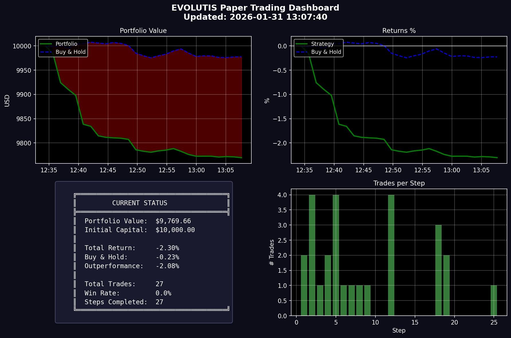

# Evolutis

**Autonomous cryptocurrency trading system.**

Evolutis develops and deploys trading strategies that adapt to changing market conditions. The system operates continuously across multiple cryptocurrency pairs.

---

## Results

### 365-Day Backtest (Jan 2025 — Jan 2026)

All 6 top agents achieved positive returns while BTC buy-and-hold returned **-8.2%** over the same period. The best agent returned **+134.5%** — an alpha of **+142.7%** over simply holding Bitcoin.

Agent 21 — Best Performer (+134.5%)

Agent 12 — +86.4%

Agent 4 — +48.3%

Agent 8 — +46.5%

Agent 34 — +44.8%

Agent 6 — +17.3%

---

## Live Trading

---

## Disclaimer

This project is for educational and research purposes only. Past performance does not guarantee future results. Cryptocurrency trading involves substantial risk of loss. Do not trade with money you cannot afford to lose.

---

## License

MIT