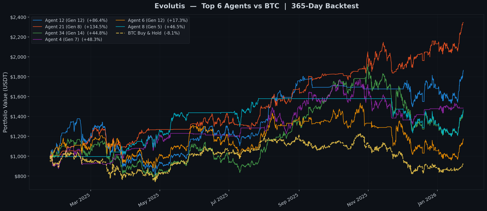
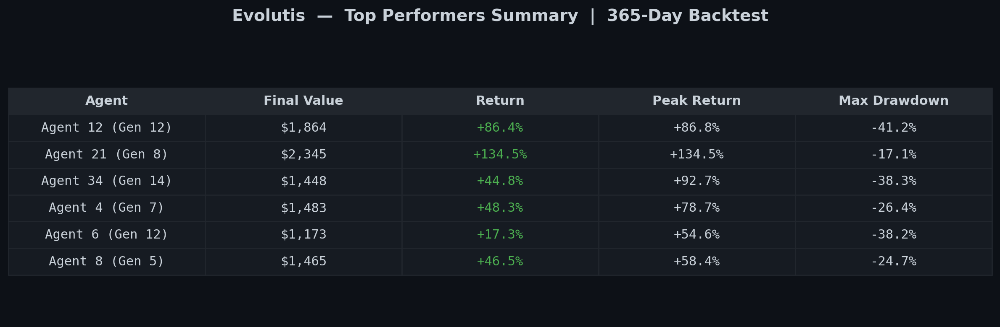
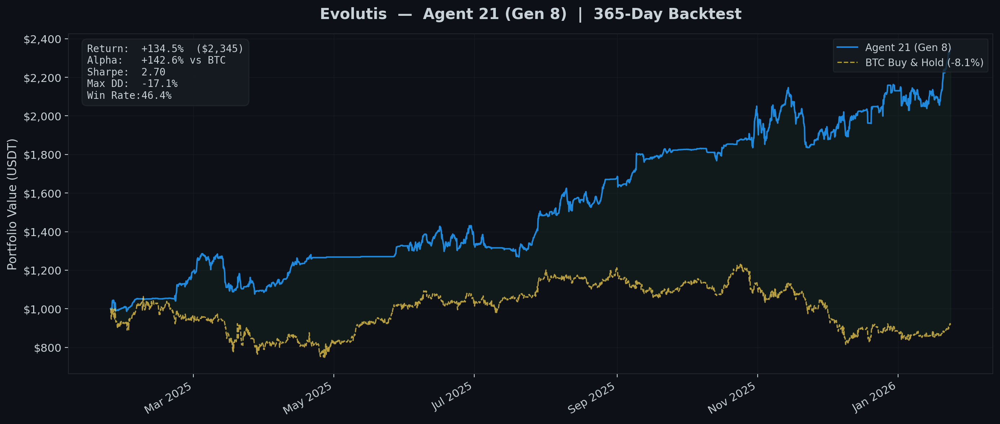
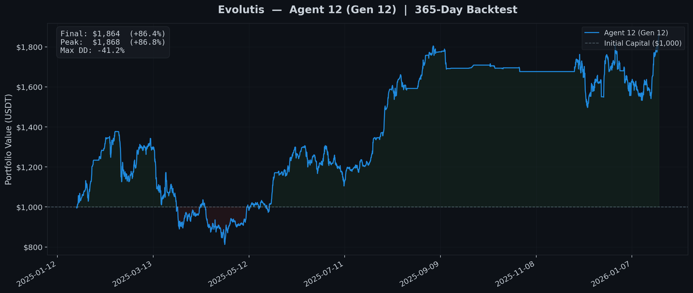
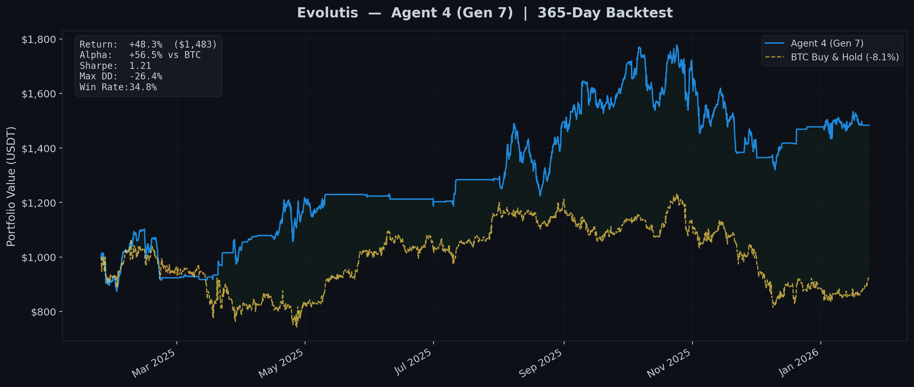
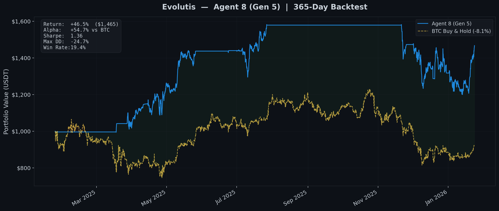
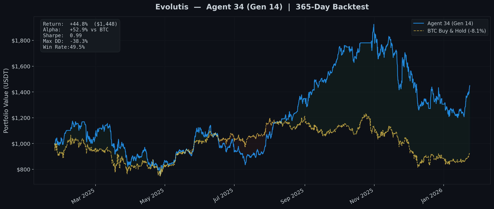
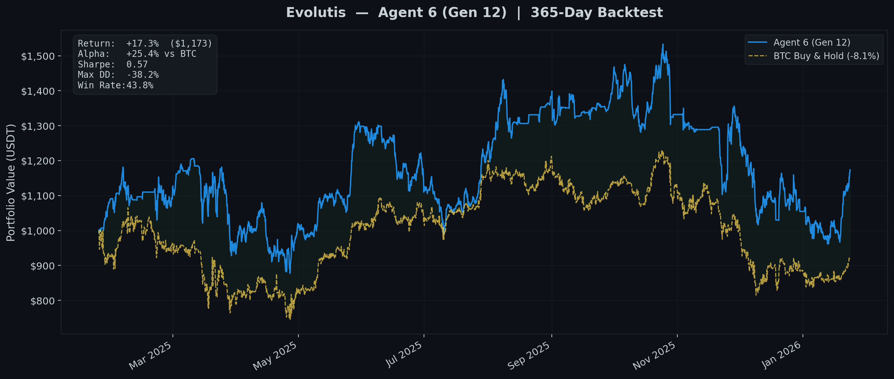

# Evolutis

**Autonomous crypto trading system powered by evolutionary reinforcement learning.**

Evolutis uses agents that they use complex multiple domain methods. The best-performing agents are selected and recombined to produce increasingly effective trading strategies across cryptocurrency pairs.

---

### Trading Architecture

- **Environment**: Custom Gymnasium environment simulating multi-asset portfolio management with realistic transaction fees, slippage, and position sizing constraints
- **Observation Space**: OHLCV data enriched with technical indicators (SMA, RSI, EMA) across multiple timeframes
- **Trading Rules**: Each agent evolves its own set of trading filters (RSI thresholds, SMA crossovers, BTC correlation stops, trailing stops, profit-taking rules)

### Execution Modes

| Mode | Description |
|------|-------------|
| **Backtest** | Simulate on historical data with full metrics |
| **Paper Trading** | Real-time market data, simulated execution |
| **Testnet Trading** | Real orders on Binance Testnet |
| **Ensemble Voting** | Multiple agents vote on trades (majority, weighted, conservative, median strategies) |

---

## Results

### 365-Day Backtest — All Top Performers

### Performance Summary

All 6 top-performing agents achieved positive returns over the 365-day backtest period (Jan 2025 — Jan 2026), while BTC buy-and-hold returned **-8.2%%** over the same period. The best agent returned **+134.5%%** — an alpha of **+142.7%%** over simply holding Bitcoin.

### Individual Agent Performance

Agent 21 (Gen 8) — Best Performer (+134.5%)

Agent 12 (Gen 12) — +86.4%

Agent 4 (Gen 7) — +48.3%

Agent 8 (Gen 5) — +46.5%

Agent 34 (Gen 14) — +44.8%

Agent 6 (Gen 12) — +17.3%

---

## Tech Stack

- **RL Framework**: Stable-Baselines3 (PPO)
- **Environment**: Gymnasium (custom trading env)
- **Data**: Binance API via ccxt (1-minute OHLCV candles)
- **Indicators**: ta (Technical Analysis library)

---

## Disclaimer

This project is for educational and research purposes only. Past backtest performance does not guarantee future results. Cryptocurrency trading involves substantial risk of loss. Do not trade with money you cannot afford to lose.

---

## License

MIT
