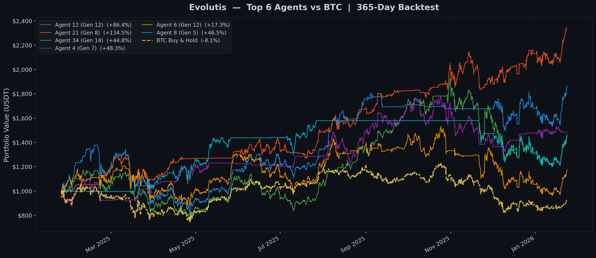
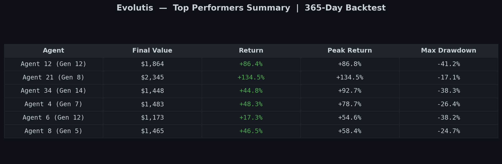
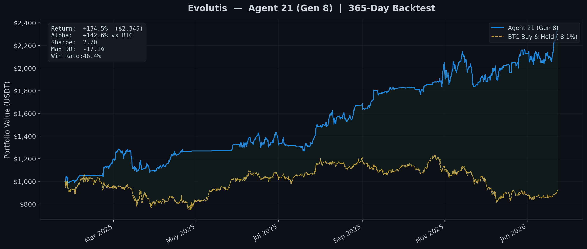
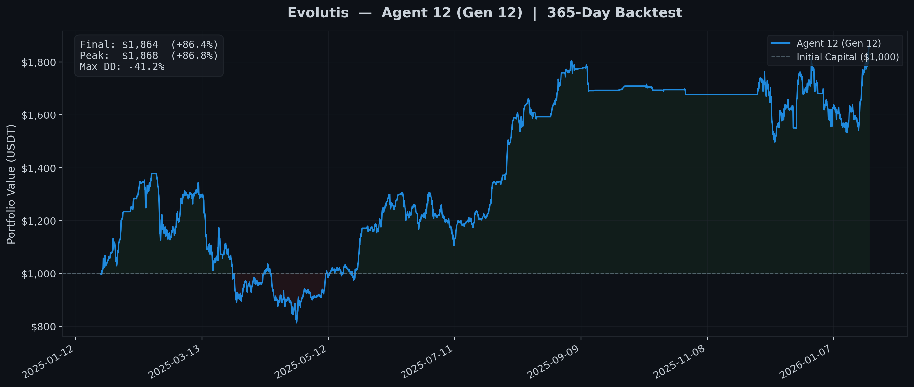
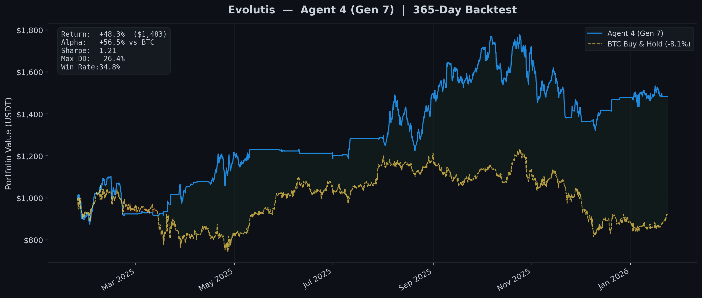
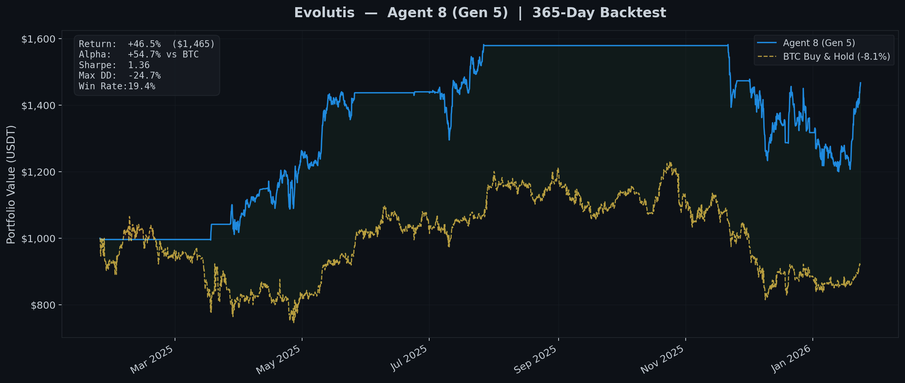
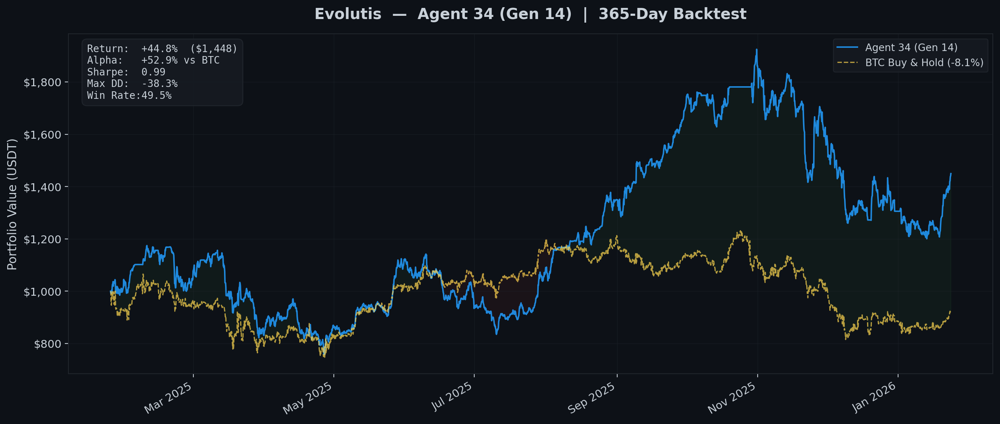
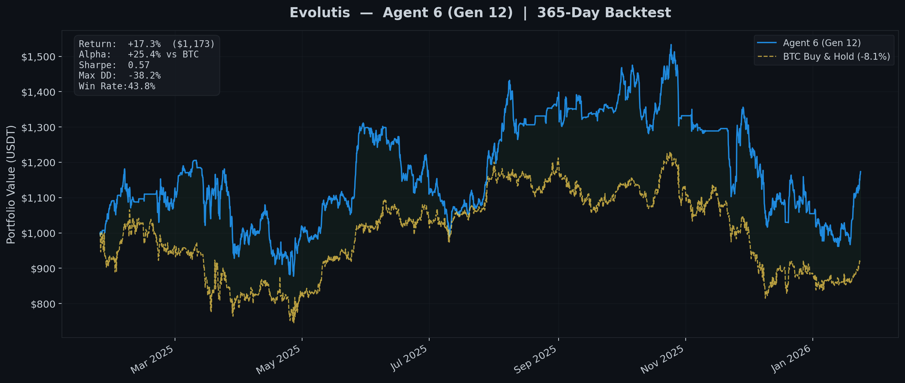
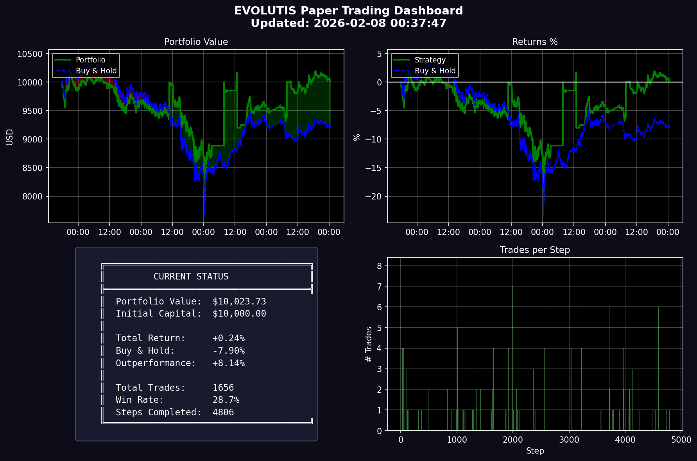

# Evolutis

**Autonomous cryptocurrency trading system.**

Evolutis develops and deploys trading strategies that adapt to changing market conditions. The system operates continuously across multiple cryptocurrency pairs.

---

## Research: Falsifying Alpha in Crypto Prediction Markets

A six-month research program that set out to break its own trading edges rather than confirm them —
roughly **1,050 hypotheses** tested under pre-registration with multiplicity-corrected bars. Every
candidate edge died, and most died for **measurement** reasons rather than statistical ones.

The deliverable is a falsification pipeline and **nine named traps** that each make a dead edge look
alive, every one reproducible on synthetic data in a few seconds:

| | Trap | The one-line diagnostic |
|---|---|---|
| 1 | Longshot tail | Judge the median, not the mean |
| 2 | Snapshot sampling | One independent observation per outcome |
| 3 | Maker adverse selection | Model the fill as an event; split fill rate by outcome |
| 4 | Overfitting gap | Optimize on train, score out-of-sample, report the gap |
| 5 | **Obtainability** | Record depth at decision time: obtainable / not / **unknown** |
| 6 | **Winner selection** | Rank *within* a price bin; check the cohort mean price |
| 7 | **Significance vs bias** | A biased t grows as sqrt(n). Pool the population |
| 8 | **Informative missingness** | Print retention per band of the test variable |
| 9 | **Metric choice** | Correlate the *style* before correlating performance |

The most expensive single lesson (Trap 5): splitting one strategy on whether the resting size had
actually been there turned a **+$202.71** headline into **-$38.74** — 100% of the apparent profit was
in trades that could not have been bought.

**[Read the research →](research/falsifying-alpha/)** &nbsp;·&nbsp;
[Methodology](research/falsifying-alpha/METHODOLOGY.md) &nbsp;·&nbsp;
[Runnable exhibits](research/falsifying-alpha/exhibits/)

---

## Results

### 365-Day Backtest (Jan 2025 — Jan 2026)

All 6 top agents achieved positive returns while BTC buy-and-hold returned **-8.2%** over the same period. The best agent returned **+134.5%** — an alpha of **+142.7%** over simply holding Bitcoin.

Agent 21 — Best Performer (+134.5%)

| Metric | Value |
|---|---|
| **CAGR** | **134.63%** |
| **Max Drawdown** | **-17.13%** |
| **Sharpe Ratio** | **2.70** |
| **Avg Trade Duration** | **49.5 hours (~2 days)** |
| **% Time in Market** | **78.04%** |
| **CAGR / Max Drawdown** | **7.86** |

Agent 12 — +86.4%

Agent 4 — +48.3%

Agent 8 — +46.5%

Agent 34 — +44.8%

Agent 6 — +17.3%

---

## Paper Trading — BTC Price Drop (Feb 3–8, 2026)

During a significant BTC drawdown in early February 2026, Agent 21 was paper trading live across 9 crypto pairs. While the market dropped nearly **-8%**, the agent preserved capital and finished slightly positive — demonstrating defensive positioning during adverse conditions.

| Metric | Value |
|---|---|
| **Duration** | 4.3 days (4,806 steps) |
| **Agent Return** | **+0.24%** |
| **Buy & Hold Return** | **-7.90%** |
| **Outperformance** | **+8.84%** |
| **Total Trades** | 1,656 |
| **Win Rate** | 28.7% |
| **Final Portfolio** | $10,023.73 |

The green line (portfolio) stays near the starting value while the blue line (buy & hold) tracks the market decline. The agent actively managed positions to avoid the worst of the drawdown, rotating into defensive allocations and limiting exposure during high-volatility periods.

---

## Live Trading

Three bots are trading with real money on [Polymarket](https://polymarket.com) — an EV-based trader, an RL-based trader, and a BTC momentum trader.

**[View Live Dashboard →](https://evolutis-ai.github.io/evolutis/live_dashboard/)**

*Dashboard auto-updates every 5 minutes.*

---

## Disclaimer

This project is for educational and research purposes only. Past performance does not guarantee future results. Cryptocurrency trading involves substantial risk of loss. Do not trade with money you cannot afford to lose.

---

## License

MIT
